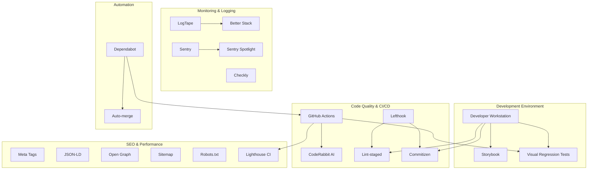

# Design Document

## Overview

This design outlines the implementation of a comprehensive development tooling ecosystem for the Next.js project. The solution integrates Storybook for component development, enhances existing monitoring and logging infrastructure, implements visual regression testing, optimizes SEO, and establishes automated dependency management. The design builds upon the existing foundation of Sentry, LogTape, Checkly, Lefthook, and other tools already configured in the project.

## Architecture

### High-Level Architecture



## Components and Interfaces

### 1. Storybook Integration

**Component**: Storybook UI Development Environment
- **Framework**: `@storybook/nextjs-vite` for optimal performance with Next.js 15
- **Addons**:
  - `@storybook/addon-a11y` - Accessibility testing
  - `@storybook/addon-docs` - Documentation generation
  - `@storybook/addon-vitest` - Integration with existing Vitest setup
- **Configuration**: 
  - App Router support enabled
  - Integration with existing Tailwind CSS setup
  - Support for Next.js fonts and images

**Interface**: 
```typescript
// .storybook/main.ts
export default {
  framework: '@storybook/nextjs-vite',
  addons: ['@storybook/addon-a11y', '@storybook/addon-docs', '@storybook/addon-vitest'],
  features: {
    experimentalRSC: true
  }
}
```

### 2. Enhanced Git Workflow

**Component**: Lint-staged Integration
- **Integration**: Extends existing Lefthook configuration
- **Scope**: Runs linters only on staged files
- **Tools**: Biome (existing), TypeScript compiler, custom scripts

**Component**: Commitizen Integration
- **Type**: Interactive commit message generator
- **Standard**: Conventional Commits (aligns with existing Commitlint)
- **Integration**: Works with existing Lefthook commit-msg hook

**Interface**:
```yaml
# lefthook.yml enhancement
pre-commit:
  commands:
    lint-staged:
      run: npx lint-staged
      stage_fixed: true
```

### 3. Visual Regression Testing

**Component**: Chromatic Integration with Storybook
- **Platform**: Chromatic for visual regression testing
- **Scope**: All Storybook stories
- **Integration**: GitHub Actions workflow
- **Baseline Management**: Automatic baseline updates on main branch

**Component**: Playwright Visual Testing Enhancement
- **Extension**: Existing Playwright setup
- **Scope**: Critical user journeys
- **Storage**: Local screenshots with CI comparison

### 4. Enhanced Logging and Monitoring

**Component**: Better Stack Integration
- **Purpose**: Centralized log management
- **Integration**: LogTape transport configuration
- **Features**: Log aggregation, alerting, dashboard

**Component**: Enhanced Sentry Configuration
- **Scope**: Production error tracking with enhanced context
- **Features**: Performance monitoring, release tracking
- **Integration**: Existing Sentry setup enhancement

**Interface**:
```typescript
// Enhanced LogTape configuration
const betterStackTransport = new HttpTransport({
  url: 'https://in.logs.betterstack.com/api/v1/logs',
  headers: {
    'Authorization': `Bearer ${process.env.BETTER_STACK_TOKEN}`
  }
});
```

### 5. SEO and Metadata System

**Component**: Next.js Metadata API Integration
- **Scope**: All pages and layouts
- **Features**: Dynamic meta tags, Open Graph, Twitter Cards
- **Structure**: Centralized metadata configuration

**Component**: JSON-LD Structured Data
- **Types**: Organization, WebSite, BreadcrumbList
- **Integration**: Next.js metadata API
- **Validation**: Schema.org compliance

**Component**: Sitemap and Robots Generation
- **Implementation**: Next.js app router sitemap.ts
- **Features**: Dynamic sitemap generation, robots.txt configuration
- **SEO**: Search engine optimization

### 6. GitHub Actions Workflows

**Component**: Comprehensive CI/CD Pipeline
- **Triggers**: Pull requests, pushes to main
- **Jobs**: 
  - Test execution (existing Vitest/Playwright)
  - Visual regression testing
  - Lighthouse CI
  - CodeRabbit integration
  - Dependency vulnerability scanning

**Component**: Automated Dependency Management
- **Tool**: Dependabot
- **Scope**: npm dependencies, GitHub Actions
- **Features**: Security updates, version updates, auto-merge for patches

## Data Models

### Storybook Story Structure
```typescript
interface StoryConfig {
  title: string;
  component: React.ComponentType;
  parameters: {
    docs: {
      description: {
        component: string;
      };
    };
    a11y: {
      config: AccessibilityConfig;
    };
  };
}
```

### Metadata Configuration
```typescript
interface PageMetadata {
  title: string;
  description: string;
  keywords?: string[];
  openGraph: {
    title: string;
    description: string;
    images: OpenGraphImage[];
  };
  jsonLd?: StructuredData[];
}
```

### Logging Structure
```typescript
interface LogEntry {
  timestamp: string;
  level: 'debug' | 'info' | 'warn' | 'error';
  message: string;
  context: Record<string, unknown>;
  userId?: string;
  sessionId?: string;
  requestId?: string;
}
```

## Error Handling

### Storybook Error Boundaries
- Component-level error boundaries for story isolation
- Development-friendly error messages
- Integration with existing error reporting

### CI/CD Error Handling
- Graceful degradation for non-critical failures
- Detailed error reporting in GitHub Actions
- Rollback strategies for failed deployments

### Monitoring Error Escalation
- Sentry for application errors
- Better Stack for infrastructure logs
- Checkly for uptime monitoring
- Integrated alerting across all systems

## Testing Strategy

### Component Testing
- Storybook stories as living documentation
- Vitest integration for component unit tests
- Accessibility testing with @storybook/addon-a11y

### Visual Regression Testing
- Chromatic for Storybook visual testing
- Playwright screenshots for critical paths
- Automated baseline management

### Integration Testing
- Existing Playwright E2E tests
- API testing with Checkly
- Performance testing with Lighthouse CI

### Performance Testing
- Lighthouse CI in GitHub Actions
- Core Web Vitals monitoring
- Bundle size analysis (existing)

## Implementation Phases

### Phase 1: Core Storybook Setup
- Install and configure Storybook with Next.js integration
- Set up essential addons (a11y, docs, vitest)
- Create initial component stories

### Phase 2: Enhanced Git Workflow
- Configure lint-staged with existing Lefthook
- Set up Commitizen for guided commits
- Update GitHub Actions for enhanced CI

### Phase 3: Visual Testing
- Implement Chromatic integration
- Enhance Playwright with visual testing
- Set up automated baseline management

### Phase 4: Monitoring Enhancement
- Integrate Better Stack for log management
- Enhance Sentry configuration
- Set up comprehensive alerting

### Phase 5: SEO Optimization
- Implement metadata system
- Add JSON-LD structured data
- Generate dynamic sitemaps and robots.txt

### Phase 6: Automation
- Configure Dependabot
- Set up auto-merge for safe updates
- Implement comprehensive GitHub Actions workflows

## Security Considerations

- API keys and tokens stored in GitHub Secrets
- Dependabot security updates prioritized
- CodeRabbit security scanning integration
- Sentry data scrubbing for sensitive information
- Better Stack log filtering for PII

## Performance Considerations

- Storybook build optimization with Vite
- Lazy loading of non-critical monitoring scripts
- Efficient log batching for Better Stack
- Lighthouse CI performance budgets
- Bundle analysis integration (existing)

## Scalability Considerations

- Modular Storybook story organization
- Scalable logging architecture with Better Stack
- Efficient visual regression testing strategy
- Automated dependency management
- Horizontal scaling support for monitoring tools